# Gmail Auto Responder Bot using Cloud Function and ADK

## Project structure
- gmail-agent
  - The AI agent created using ADK
- cloud-functions
  - Cloud function to read pub/sub, send/recieve mails and trigger the agent

## What are we doing

- An email arrives.
- Gmail's watch() detects this.
- A notification message (containing the new historyId for the mailbox) is sent to your Pub/Sub topic.
- This Pub/Sub message triggers your main Cloud Function (process_new_email).
- Inside the Cloud Function:
- It decodes the Pub/Sub message to get the historyId from the notification (historyId_event).
- It queries Firestore to get the last_processed_history_id for the TARGET_USER_EMAIL (this is the startHistoryId for the Gmail API call).
- It calls users.history.list to get all changes since last_processed_history_id.
- It loops through any messagesAdded events found in the history.
- For each new message:
- Fetches the full email content.
- Extracts necessary details.
- Uses Firestore to find an existing agent session for the email's threadId or creates a new one.
- Sends the email body to your Vertex AI Agent Engine using the correct session.
- Gets the reply from the agent.
- Uses the Gmail API to send the reply.
- Marks the original email as read (or processed).
- After processing all new messages in the batch, it updates Firestore with historyId_event as the new last_processed_history_id.

## Architecture

```mermaid
graph TD
    A[External Email Arrives in Monitored Gmail Account] --> B{Gmail API: watch};
    B --> C[Pub Sub Topic: New Email Notification contains historyId];
    C --> D[Cloud Function Triggered];

    subgraph Cloud Function Logic
        D --> E{Decode Pub/Sub Msg get notified historyId_event & emailAddress};
        E --> F[Firestore: Get last_processed_history_id for emailAddress];
        F --> G{Gmail API: users.history.liststartHistoryId=last_processed_history_id};
        G --> H{Parse History: Identify new message IDs};
        H --> I{For each new message ID};
        I -- Yes --> J[5a. Gmail API: users.messages.getmessageId, format='full'];
        J --> K[Extract Email Details body, sender, threadId];
        K --> L[Firestore: Get/Create Agent Session ID based on threadId];
        L --> M[Vertex AI Agent Engine: agent.querysession_id, email_body];
        M --> N[Receive Agent's Text Reply];
        N --> O[Gmail API: users.messages.sendreply_email_as_TARGET_USER_EMAIL];
        O --> P[Gmail API: users.messages.modifymessageId, removeLabel='UNREAD'];
        P --> I;  
        I -- No more messages --> Q[Firestore: Update last_processed_history_id with historyId_event];
        Q --> R[End Processing];
    end

    style A fill:#111,stroke:#FFF,stroke-width:2px
    style C fill:#111,stroke:#FFF,stroke-width:2px
    style M fill:#111,stroke:#FFF,stroke-width:2px
    style F fill:#111,stroke:#FFF,stroke-width:2px
    style I fill:#511,stroke:#FFF,stroke-width:2px
    style J fill:#111,stroke:#A11,stroke-width:2px
    style K fill:#111,stroke:#A11,stroke-width:2px
    style L fill:#111,stroke:#A11,stroke-width:2px
    style M fill:#111,stroke:#A11,stroke-width:2px
    style Q fill:#111,stroke:#FFF,stroke-width:2px
```

